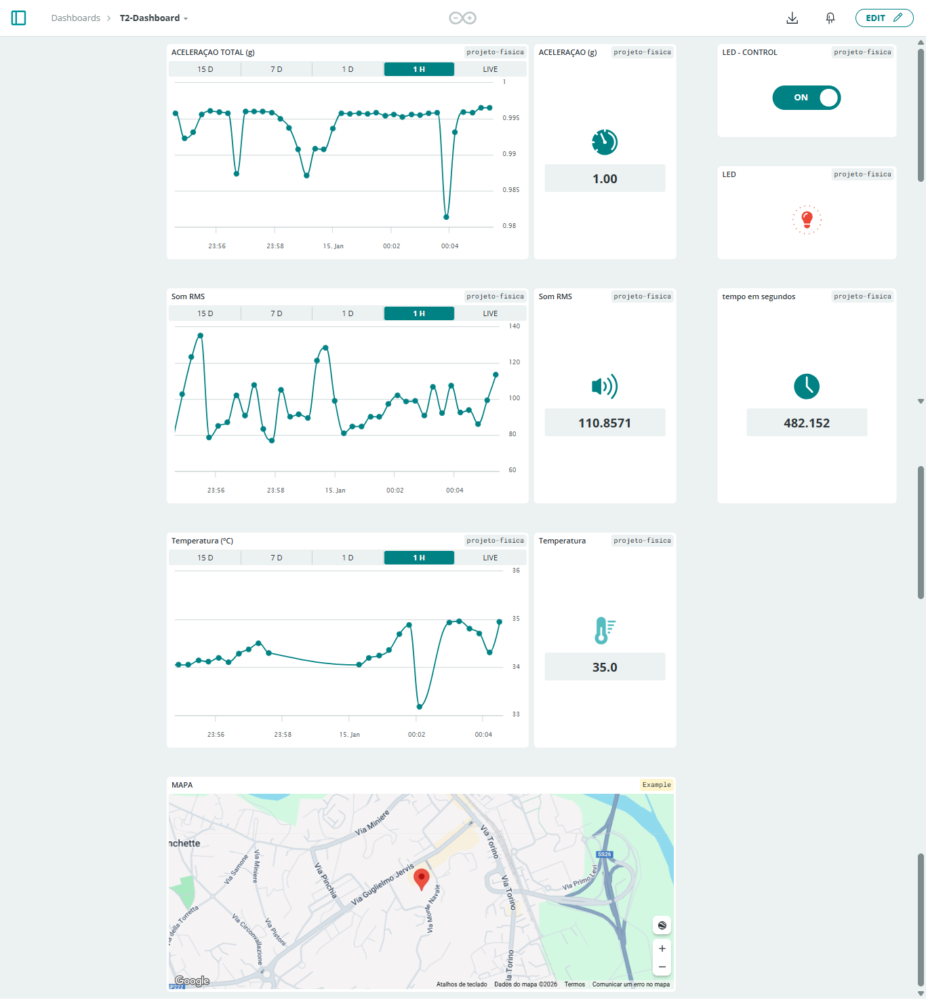
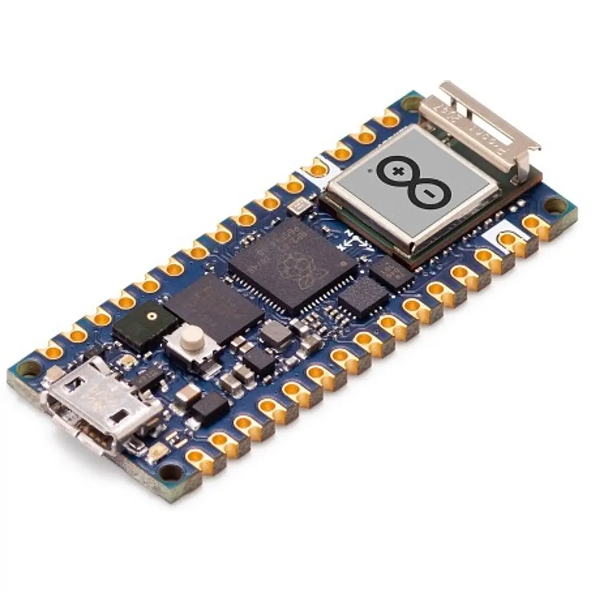

# 🚀 Arduino IoT Data Monitoring System

## 📖 Description
This project was developed as part of the Applied Physics for Computing course at IPBeja and demonstrates a complete IoT pipeline including data acquisition, cloud monitoring, and data analysis.

---

## 📊 Dashboard

<p align="center">
  
</p>
---

## ⚙️ Features
- Real-time sensor data acquisition from multiple sensors  
- Moving average filtering for noise reduction  
- Timestamped sensor readings  
- Visualization via Serial Monitor and Serial Plotter  
- Integration with Arduino Cloud (Dashboard)  
- Python data analysis using Jupyter Notebook  
- Statistical analysis (mean, median, min, max, standard deviation)  
- Alert system for threshold detection  
- Export of processed data to Excel  

---

## 📡 Hardware

### 🔌 Arduino Nano RP2040 Connect

<p align="center">
  
</p>

### 🔍 Sensors
- IMU (Accelerometer + Gyroscope + Temperature)  
- Microphone (RMS and Peak sound levels)  

---

## 🧠 System Overview

### 1️⃣ Data Acquisition (Arduino)
- Reads all sensors simultaneously  
- Applies moving average filtering  
- Sends data via Serial and Cloud  

### 2️⃣ Cloud Visualization (Arduino Cloud)
- Real-time dashboard  
- Graphs and indicators  
- Alerts and LED control  

### 3️⃣ Data Processing (Python)
- Reads serial data  
- Generates graphs and statistics  
- Detects anomalies  
- Exports results to Excel  

---

## 📁 Project Structure

```
arduino/
    lab01_sensores/
    lab02_arduino_cloud/

python/
    lab03_data_analysis/

dashboard/
    dashboard.png

assets/
    arduino_nano_rp2040_connect.webp

docs/
    (academic task descriptions)
```

---

## 🎯 Learning Outcomes
- IoT system integration  
- Embedded systems programming (Arduino)  
- Data acquisition and filtering  
- Cloud-based monitoring systems  
- Data analysis with Python  
- Visualization and reporting  

---

## 🔒 Security Note
Credentials such as device IDs, API keys, and secret keys are NOT included in this repository for security reasons.

---

## 📌 Academic Context
This project combines three laboratory tasks:
- Sensor data acquisition  
- Arduino Cloud dashboard development  
- Data processing and visualization with Python  
